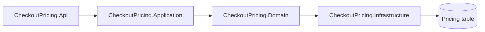

<!-- markdownlint-disable-file -->
# Diagrams — loyalty-discount

```mermaid
flowchart LR
  Api[CheckoutPricing.Api] --> App[CheckoutPricing.Application]
  App --> Dom[CheckoutPricing.Domain]
  Dom --> Infra[CheckoutPricing.Infrastructure]
  Infra --> Db[(Pricing table)]
```

The pricing policy lives in the Domain and reaches the pricing table through the Infrastructure
repository it references.
