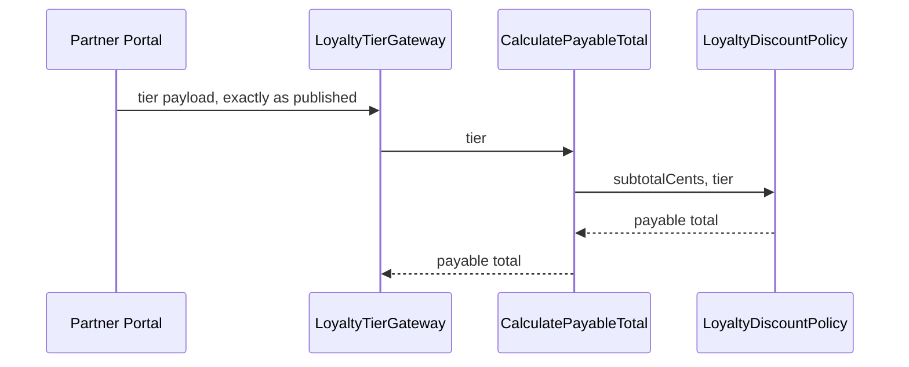

<!-- markdownlint-disable-file -->

# Diagrams — loyalty tier

**Date:** 2026-08-13

## How a tier reaches pricing

## Where the tier comes from

The tier is published by the Partner Portal, a system the loyalty team does not
own. `LoyaltyTierGateway` reads the published payload and passes the tier straight
through: it maps field names only, and adds no step of its own between the Partner
Portal and `CalculatePayableTotal`.

## Deployment

One process. The gateway is a library call, not a network hop, in this slice.
