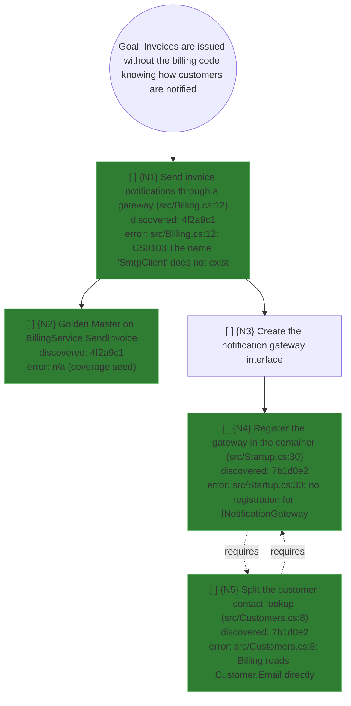

<!-- markdownlint-disable-file -->
# Prerequisites: notifications out of billing

```mermaid
graph TD
  G((Goal: Invoices are issued without the billing code knowing how customers are notified))
  classDef observed fill:#2e7d32,stroke:#66bb6a
  classDef anticipated fill:#e65100,stroke:#ff9800,stroke-dasharray:5 5
  N1["[ ] {N1} Send invoice notifications through a gateway (src/Billing.cs:12)<br/>discovered: 4f2a9c1<br/>error: src/Billing.cs:12: CS0103 The name 'SmtpClient' does not exist"]
  N2["[ ] {N2} Golden Master on BillingService.SendInvoice<br/>discovered: 4f2a9c1<br/>error: n/a (coverage seed)"]
  N3["[ ] {N3} Create the notification gateway interface"]
  N4["[ ] {N4} Register the gateway in the container (src/Startup.cs:30)<br/>discovered: 7b1d0e2<br/>error: src/Startup.cs:30: no registration for INotificationGateway"]
  N5["[ ] {N5} Split the customer contact lookup (src/Customers.cs:8)<br/>discovered: 7b1d0e2<br/>error: src/Customers.cs:8: Billing reads Customer.Email directly"]
  G --> N1
  N1 --> N2
  N1 --> N3
  N3 --> N4
  N4 -.requires.-> N5
  N5 -.requires.-> N4
  class N1,N2,N4,N5 observed
```
